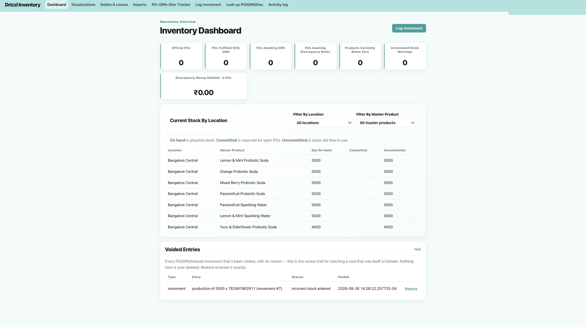
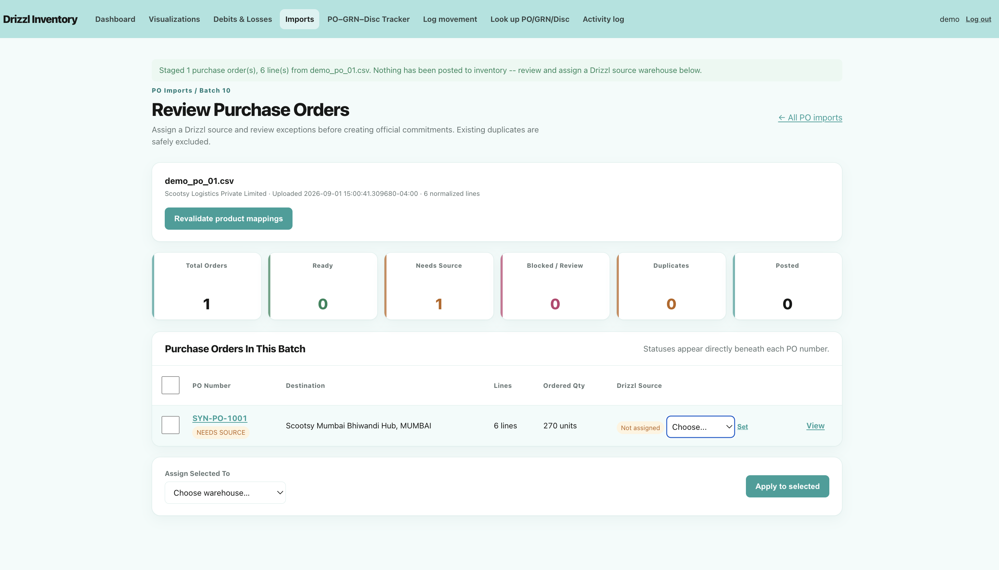
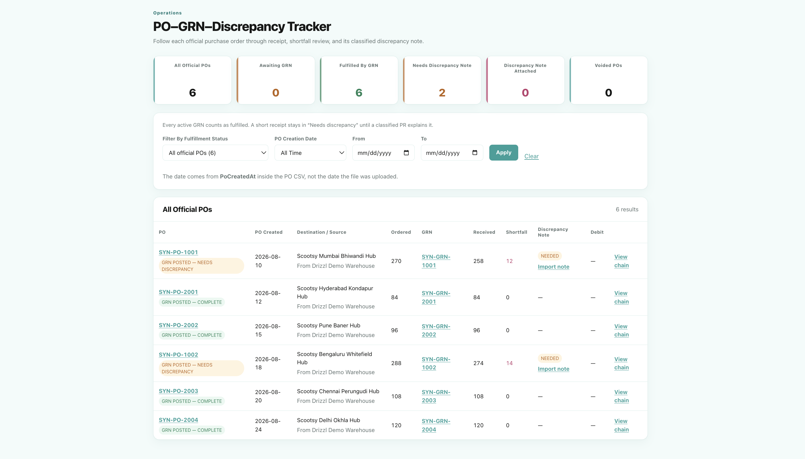
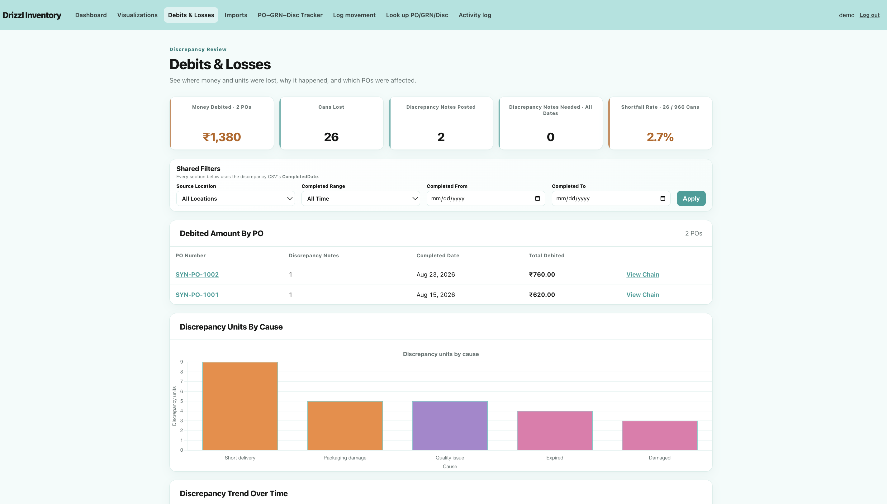

# Inventory and Exception Management for a Growing Beverage Company

[](https://github.com/reniwalriona-create/Drizzl-inventory-exception-management-system/actions/workflows/verify.yml)

An internal inventory ledger and B2B document-reconciliation system designed and built for **Drizzl**, a probiotic soda brand managing seven products across two company warehouses and approximately 15 customer fulfillment locations in India.

**Role:** Product & Business Analyst / Project Lead<br>
**Ownership:** Discovery, requirements, business rules, data and workflow design, UX, implementation, validation, and deployment<br>
**Stack:** Python, Flask, PostgreSQL, SQL, HTML/CSS, JavaScript, Chart.js<br>
**Status:** Privately deployed on August 26, 2026 for a controlled two-month pilot

[**Watch the 2:27 product demo →**](https://youtu.be/jKcDjJRn7pU)

> This is a sanitized portfolio copy. It uses fictional identifiers, synthetic documents, and demonstration data. The privately deployed operational instance is not publicly accessible and is not connected to this repository.

## At a glance

| Business problem | Product response |
|---|---|
| Inventory was fragmented across spreadsheets and informal updates. | Stock is calculated from a traceable ledger of product and location movements. |
| POs, GRNs, shortfalls, and debit records required manual reconstruction. | A connected workflow stages, validates, posts, and traces the full fulfillment chain. |
| External platform SKUs could fragment the same physical product. | Customer SKUs map to one canonical Master Product identity. |
| Corrections could erase context or deduct stock twice. | Void, restore, and supersession preserve history while current calculations remain correct. |

## The problem

Drizzl's operating process covered formal B2B fulfillment as well as production, transfers, direct sales, consignment, promotions, events, trials, damage, and expiry. These activities did not all generate the same paperwork, and they were not captured in one dependable system.

Purchase orders and Goods Received Notices were reconciled across multiple spreadsheets. New orders were usually discovered through email, older GRNs could be missed, and discrepancy notes and customer debits were not consistently connected to the original order. Informal stock movements could also go unrecorded, so a spreadsheet could show sufficient inventory while the warehouse was unable to fulfill an order.

## What I built

The product brings formal customer documents and manual operational movements into one inventory history:

```text
PO CSV → validate products → assign source warehouse → post commitment
GRN CSV → compare ordered and received quantities → post fulfillment and shortfall
Discrepancy CSV → classify the existing shortfall and attach its debit value

Manual entry → production · transfer · direct sale · loss
                                      ↓
                         Inventory movement ledger
                                      ↓
              Dashboard · tracker · reports · activity history
```



## Four decisions that made the system trustworthy

### 1. One product identity across every channel

Different commerce platforms can use different SKU codes for the same Drizzl product. External identifiers therefore map to one internal Master Product. Unknown mappings block posting instead of silently creating a new product or fragmented stock pool.

### 2. Review imported documents before posting

Uploaded files never write directly to official inventory records. Each file enters a staging area where the operator reviews duplicates, missing references, product mappings, quantities, and source-warehouse assignment. Only an explicit posting action creates an official commitment or movement.



### 3. Separate commitments, physical movements, and financial explanations

A posted PO reserves stock but does not remove it. A matching GRN records the physical fulfillment: received units become a sale and any ordered-versus-received shortfall becomes an unclassified loss. A later discrepancy record classifies that existing loss and records its debit value without deducting inventory a second time.

### 4. Correct history instead of deleting it

Operational records can be voided, restored, or superseded. Current calculations remain accurate while the original record, responsible user, reason, and correction path remain visible.



## My ownership

I owned the project end to end, including stakeholder discovery, requirements, business rules, canonical data modeling, workflow design, UX, implementation, testing, and deployment. A Drizzl cofounder and the fulfillment lead supplied operational context and reviewed the evolving workflow; I remained responsible for the product and implementation decisions.

The product was developed iteratively from August 7 through August 26, 2026. Delivery included stakeholder interviews, process mapping, sample-document analysis, acceptance criteria, weekly reviews, end-to-end validation, a guided user walkthrough, and private deployment for the two intended pilot users.

## Validation and current status

The PostgreSQL-backed verification workflow covers product identity, staged imports, posting, inventory behavior, corrections, security, reporting, and database integrity. Mutating checks use disposable databases rather than operational records, and the same 15-suite gate runs automatically on every push and pull request to `main`.

The system is currently a controlled pilot release. I do not claim measured business impact yet. The pilot is intended to evaluate reconciliation time, missing-document frequency, inventory-warning accuracy, manual-movement adoption, shortfall and debit visibility, and user feedback.



## Explore the project

- [Long-form case study](case-study/CASE_STUDY_LONG.md)
- [Technical documentation and local setup](TECHNICAL_README.md)
- [Synthetic demonstration fixtures](fixtures/synthetic/)
- [Product demo](https://youtu.be/jKcDjJRn7pU)
