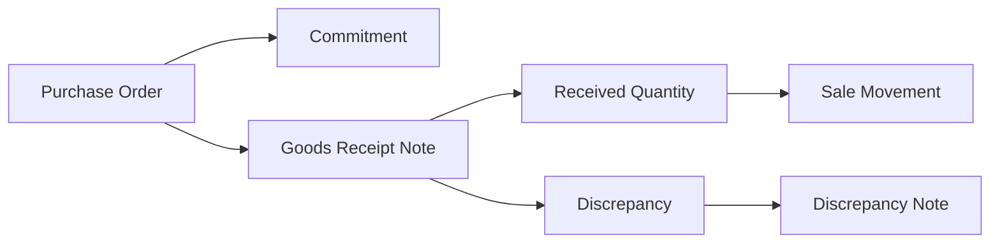

# Drizzl Inventory Management System

> A lightweight internal inventory and document-reconciliation system built for **Drizzl**, a growing probiotic soda brand.

**Status:** Active MVP / architecture checkpoint  
**Stack:** Python · Flask · SQLite · HTML/CSS/JavaScript · PDF parsing  
**Focus:** Inventory ledger design · B2B document reconciliation · operational tooling

---

## Overview

Drizzl's inventory operations were originally managed through Excel and Google Sheets. That worked while the business was small, but it became increasingly difficult to answer basic operational questions reliably as stock moved between locations and B2B orders generated more paperwork.

This project is an internal inventory-management prototype designed to create a clearer operational source of truth for:

- physical inventory by location
- production and opening balances
- transfers between Drizzl-controlled locations
- sales and losses
- Purchase Orders (POs)
- Goods Receipt Notes (GRNs)
- expected vs. received quantities
- discrepancy tracking
- Discrepancy Notes
- committed vs. available inventory
- document traceability and activity history

The application is intentionally being built iteratively around Drizzl's real operating workflow rather than as a generic inventory template.

---

## The Core Design Decision: Inventory as a Ledger

The most important architectural decision in the project is that **physical inventory is derived from an inventory movement ledger**.

The system does not store a mutable `current_inventory` number and repeatedly overwrite it. Instead, every physical event is recorded as a movement and current stock is calculated from that history.

```text
Opening Balance / Production
          ↓
      Inventory IN

Transfer
Location A ── OUT ──→ Location B ── IN

Sale / Loss
          ↓
      Inventory OUT
```

This makes inventory explainable: a location balance can be traced back to the movements that created it.

### Physical inventory vs. commercial commitment

A Purchase Order does **not** physically remove stock. It represents inventory that has been promised to a customer.

The system therefore separates:

```text
On Hand      = physical inventory from the movement ledger
Committed    = inventory reserved against open Purchase Orders
Uncommitted  = On Hand - Committed
```

This distinction is important because Drizzl may physically possess inventory that is no longer truly available for another order or transfer.

---

## B2B Document Flow

The application currently models a simplified B2B fulfillment workflow:



### Purchase Order

A PO records what the customer expects Drizzl to supply. It creates a **commitment**, but not a physical inventory movement.

The system also distinguishes the customer's receiving facility from the Drizzl location expected to fulfill the order. These are separate business concepts and should never be treated as interchangeable.

### Goods Receipt Note

The GRN represents what the customer actually received.

For example:

```text
PO / expected quantity: 600
GRN received quantity:  200

Sale:          200
Discrepancy:   400
Commitment:      0
```

Only the **received quantity** becomes a sale. The 400-unit difference is not automatically treated as a physical loss and is not left committed against the same PO. Instead, it enters the discrepancy workflow for investigation.

### Discrepancy Note

A Discrepancy Note is intended to explain a discrepancy already identified on the GRN. It can capture reasons, remarks, responsibility, and affected quantities without automatically writing stock off as lost.

Debit Notes were explored earlier in development but intentionally removed from the active MVP workflow until the business rules around them are clearer.

---

## Current Features

The current prototype includes:

- dashboard with inventory and operational reporting
- inventory by SKU and location
- On Hand / Committed / Uncommitted inventory views
- manual movements for production, opening balances, transfers, sales, and losses
- Purchase Order PDF parsing and ingestion
- GRN PDF parsing and ingestion
- Discrepancy Note PDF parsing and ingestion
- expected-vs-received discrepancy calculations
- Drizzl source-location assignment
- PO → GRN → Discrepancy document lookup
- activity/history logging
- ingestion and inventory flags
- negative physical inventory warnings
- separate commitment-shortfall warnings
- movement and document void/restore workflows
- dashboard charts and operational visualizations
- verification scripts for key parser and GRN/commitment workflows

---

## Project Structure

```text
app.py
├── Flask routes and UI workflows

schema.sql / db.py
├── SQLite schema, connection handling, and prototype migrations

ingest.py
├── document ingestion
├── inventory movements
├── source-location assignment
└── void / restore behavior

reconcile.py
├── inventory calculations
├── commitments
├── discrepancies
└── dashboard/reporting queries

po_parser.py
grn_parser.py
discrepancy_note_parser.py
debit_note_parser.py (dormant — CLI-only, not in the active web workflow)
└── document-specific PDF extraction

templates/ + static/
└── Flask UI

verify_*.py
└── parser and business-workflow verification scripts
```

The separation is intentional: parsers extract what a document says, ingestion turns valid business events into stored records, and reconciliation derives operational views from those records.

---

## A Scaling Lesson: Customer SKUs Are Not Product Identity

One of the most important design realizations in this stage of the project came from looking ahead at how the business is about to change, not from a problem hit in production.

The initial implementation uses one SKU as the primary identifier for each product. That has been workable so far because every document has come from a single B2B customer (Scootsy) using one consistent set of identifiers. That assumption is about to break: Drizzl is onboarding a second brand/customer, whose documents will introduce their own SKU codes for what are, physically, the same or overlapping products.

The shape of the problem looks like this:

```text
Customer A SKU: SC-MNG-24
Customer B SKU: MANGO250X

                 ↓
        Drizzl Mango 250 ml
```

That exposes an important modeling problem before it becomes a bug: **a customer SKU is an external identifier, not the identity of the physical product in Drizzl's inventory.**

The planned architecture change is to introduce:

```text
Master Drizzl Product
        ↑
        │
Customer + External SKU Mapping
```

The planned model will preserve the SKU exactly as it appeared on the original PO/GRN for document auditability, while mapping that value to a stable Drizzl-controlled product ID for inventory calculations.

**This refactor has not been implemented yet** — it is queued as the next piece of work, ahead of the new customer's first documents arriving, specifically so the SKU-identity assumption never gets baked further into the reconciliation logic.

This has been a useful product-engineering lesson: data models that are valid for an early operating process can become incorrect as the business gains customers, and the right response is to revisit the domain model proactively rather than patch increasingly complex SKU-specific logic around it after the fact.

---

## Reliability Rules Being Designed Into the System

As the prototype moves toward real internal use, several principles guide development:

### Do not invent operational facts

If a GRN cannot be confidently tied to a Drizzl source location, the system should flag the uncertainty rather than silently assume a warehouse.

### Preserve reality even when it looks wrong

A genuine business document may imply negative inventory because an earlier movement is missing. The system should make that inconsistency visible rather than reject reality solely to keep the database positive.

### Uploaded is not the same as verified

Documents can be stored for investigation without immediately being trusted to change business state. Validation between PO, GRN, product, quantity, and Discrepancy Note data is an active area of development.

### Correct history instead of erasing it

The ledger uses void/restore semantics for manual corrections so historical events can remain traceable. Derived document movements are being brought toward the same correction model.

---

## Current Development Checkpoint

This repository represents an **MVP under active engineering review**, not a production-ready inventory system.

The current phase is focused on strengthening business invariants before adding more features. Key work in progress includes:

1. separating Master Products from customer-specific SKU aliases, ahead of a second brand/customer coming online
2. tightening PO source-location allocation and GRN source verification
3. deciding what a confirmed GRN discrepancy should actually do to inventory, once there's a clear real-world rule for it
4. making derived GRN movement corrections fully auditable and idempotent
5. improving transaction boundaries and flag lifecycle behavior
6. expanding automated regression tests around inventory invariants

Production readiness will additionally require authentication, CSRF protection, production secret management, stronger upload controls, a production database/deployment strategy, automated backups, and formal migrations.

---

## Running Locally

### 1. Create and activate a virtual environment

```bash
python -m venv .venv
source .venv/bin/activate
```

On Windows:

```bash
.venv\Scripts\activate
```

### 2. Install dependencies

```bash
pip install -r requirements.txt
```

### 3. Start the application

```bash
python app.py
```

The development server currently runs on port `5001` unless the `PORT` environment variable is set.

> The current `app.py` uses Flask debug mode for local development. This configuration is not intended for deployment.

---

## Verification

The repository currently contains focused verification scripts for the document parsers and critical fulfillment logic, including:

```bash
python verify_po_parser.py
python verify_grn_parser.py
python verify_discrepancy_note_parser.py
python verify_grn_workflow.py
python verify_commitment_layer.py
```

These scripts are being evolved toward a fuller automated regression suite as the domain model stabilizes.

---

## What I Learned Building This

I started this project as a recent Information Science graduate, not as a trained software engineer. I have been building it iteratively with AI-assisted development while deliberately focusing on understanding the architecture and business logic rather than treating generated code as a finished product.

The most valuable parts of the project have been the modeling decisions that emerged from real operational edge cases:

- separating physical inventory from commitments
- using an event ledger instead of a mutable stock field
- distinguishing a customer's receiving facility from Drizzl's source warehouse
- using received rather than expected quantity to recognize a sale
- keeping discrepancies separate from confirmed physical losses
- recognizing, ahead of a second customer's documents arriving, that an external identifier such as a customer SKU should not be the system's canonical product identity
- recognizing that parser success is different from business-level document verification
- designing corrections so the system remains explainable rather than simply producing the right total

The project is therefore as much an exercise in **product and domain modeling** as it is in Flask development.

---

## Roadmap

**Near term**

- Master Product + external SKU mapping (ahead of a second brand/customer coming online)
- stricter PO → GRN verification
- source-location validation
- a decided rule for what a confirmed GRN discrepancy should do to inventory
- stable correction semantics for derived inventory movements
- transaction and validation hardening

**Before internal production use**

- authentication and user-level audit trails
- CSRF protection and secure configuration
- formal database migrations
- automated backups and restore testing
- production deployment/database strategy
- stronger file-upload controls
- comprehensive automated tests

**Later**

- bulk opening-inventory workflow
- broader customer/document-format support
- role-based permissions
- richer exception-resolution UI
- additional operational analytics

---

## Why This Project Matters

Inventory systems become difficult not because adding and subtracting units is complicated, but because operational reality is ambiguous: documents disagree, customers use different identifiers, stock is committed before it moves, receipts can be partial, and corrections need to remain auditable.

This project is an attempt to model those distinctions explicitly and build a lightweight system that can grow with the business instead of recreating a spreadsheet in a browser.
