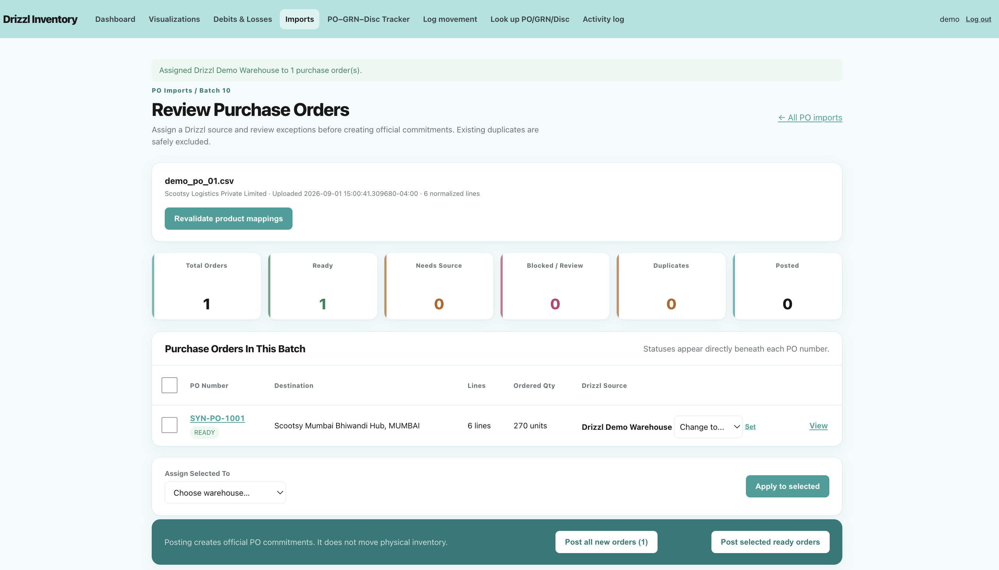
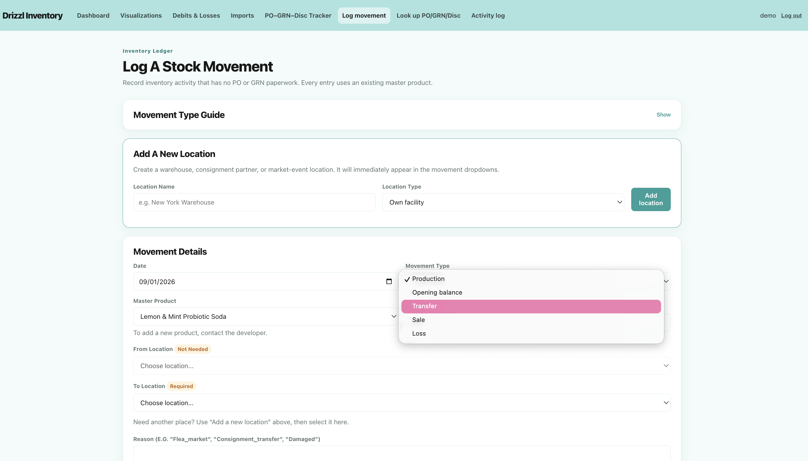
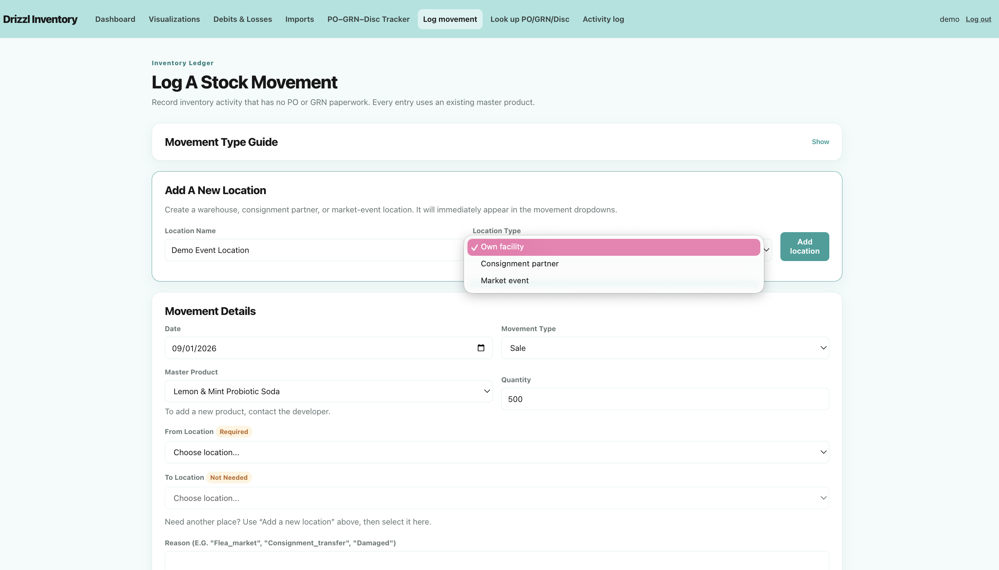
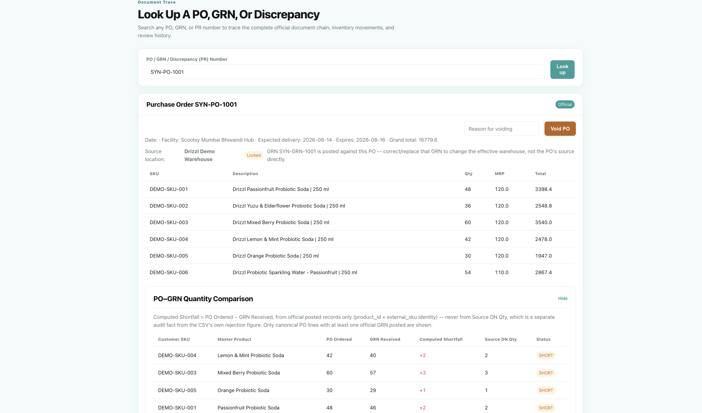
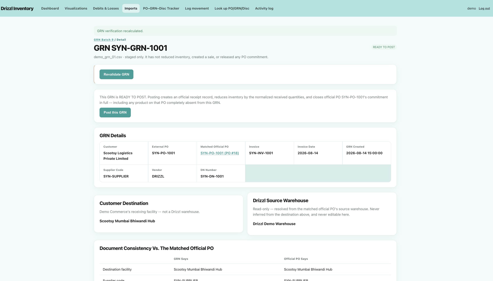
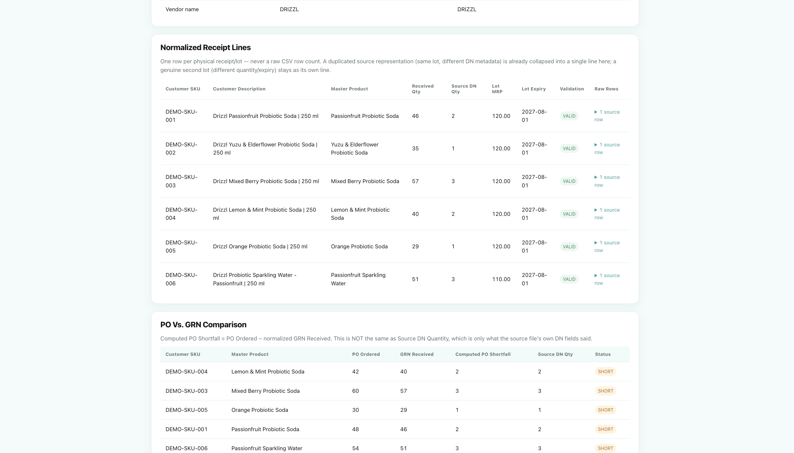
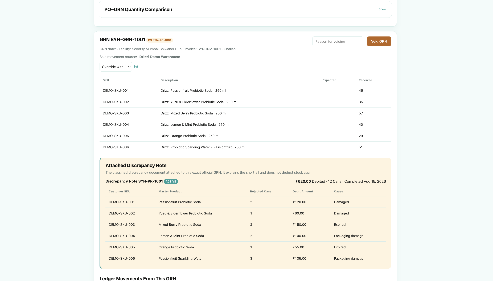
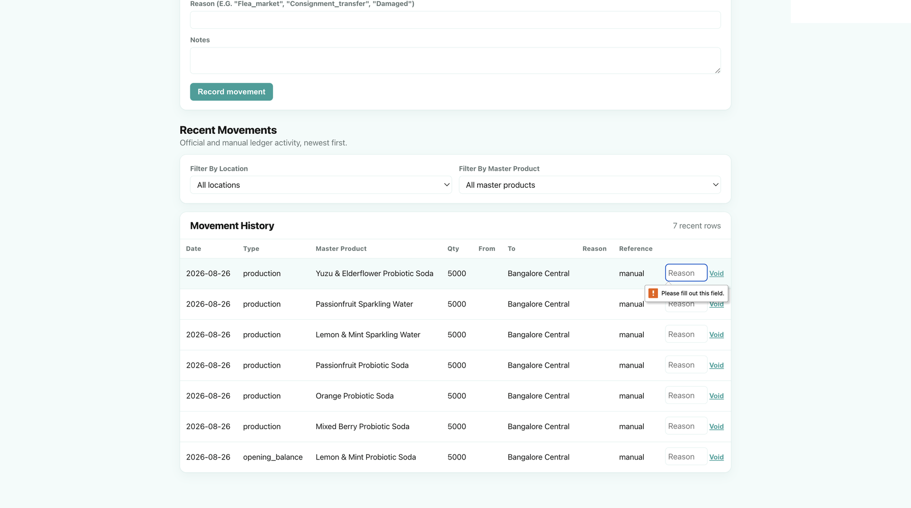
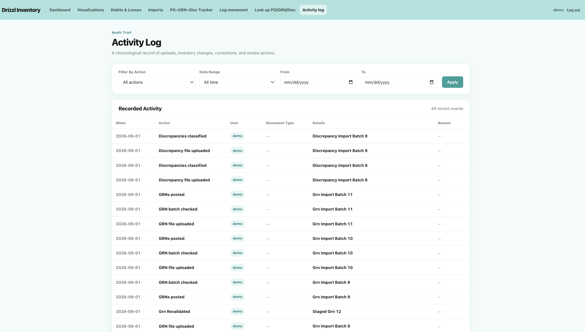
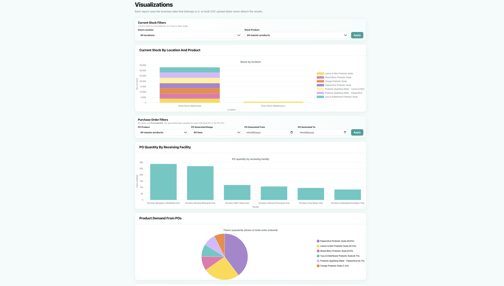

# Long Case Study: Inventory and Exception Management for a Growing Beverage Company

## From fragmented spreadsheets to auditable inventory operations

**Role:** Product & Business Analyst / Project Lead<br>
**Additional ownership:** Workflow and data design, UX, implementation, validation, and deployment<br>
**Product:** Internal operations web application<br>
**Status:** Privately deployed August 26, 2026; in a controlled two-month pilot<br>
**Stack:** Python, Flask, PostgreSQL, server-rendered HTML, Flask-Login, Flask-WTF<br>
**Focus:** Inventory visibility, B2B document reconciliation, exception management, and operational accountability

> This portfolio case study uses fictional identifiers, synthetic documents, and sanitized screenshots. The privately deployed operational instance is restricted to its intended users and is not connected to this repository.

[**Watch the 2:27 demo walkthrough →**](https://youtu.be/jKcDjJRn7pU)

[Read the technical documentation](../TECHNICAL_README.md) · [Read the short case study](../README.md)

The video demonstrates the end-to-end workflow with synthetic data and concise feature callouts; this long-form case study documents the discovery, product decisions, implementation, validation, and rollout.

## Executive summary

Drizzl is an early-stage probiotic soda company with seven products and a growing mix of sales channels. It supplies consumer-facing commerce platforms through a B2B fulfillment process, sells directly to retailers, cafés, and corporate customers, and moves stock through flea markets, promotions, consignment partners, product trials, and internal transfers. Two team members coordinate these operations across Drizzl's warehouses in Mumbai and Bangalore and approximately 15 customer fulfillment locations across India.

The company's inventory process had not kept pace with this operating complexity. Purchase orders and Goods Received Notices were reconciled across several spreadsheets, delivery schedules were maintained separately, new orders were usually discovered through email, and discrepancy notes and customer debits were not tracked consistently. Informal stock movements—such as cans taken for events, promotions, or testing—often had no suitable place to be recorded. As a result, the spreadsheet could show sufficient inventory while the warehouse was unable to fulfill an order, and the founders spent significant time trying to reconstruct what had happened.

I converted this ambiguous spreadsheet process into a deployed inventory and exception-management system. The product brings B2B purchase orders, receipts, shortfalls, discrepancy notes, and debits into one connected workflow while also capturing production, transfers, direct sales, losses, and other manual movements. It creates location-level inventory from a traceable history of stock events, validates imported documents before they affect official records, and preserves the context behind corrections. The product was deployed on August 26, 2026 and is now in a controlled two-month pilot with its intended users.

### My contribution

I owned the project end to end: problem framing, requirements, business rules, workflow and data design, UX, implementation, testing, and deployment. A Drizzl cofounder and the employee responsible for inventory and fulfillment supplied operational knowledge and reviewed the evolving workflow; I remained responsible for the product and implementation decisions.

## Discovery and delivery approach

The project began on August 7, 2026 with stakeholder interviews about the existing inventory and fulfillment process. The original request was modest: improve the spreadsheet used to match POs and GRNs and provide a better view of stock. Through notes, process maps, sample-document analysis, and acceptance criteria, I found that the visible spreadsheet problem was only one part of the operating gap.

Until August 12, I continued collecting historical PO, GRN, and discrepancy samples and reviewing the workflow with the employee responsible for fulfillment. This exposed inventory changes that the original request did not cover: production, transfers, flea markets, promotions, samples, testing, office consumption, damage, and losses. It also revealed that discrepancy notes and customer debits were not being reconciled, and that future commerce platforms could use different SKUs for the same Drizzl product.

Development and testing continued iteratively through deployment on August 26. I reviewed progress at weekly milestones, resolved detailed questions through WhatsApp because of the time difference, and shared a complete workflow video before deployment. The two intended users then completed a guided, screen-shared walkthrough of the system.

| Delivery stage | Activities and outputs |
|---|---|
| August 7–12: discovery | Stakeholder interviews, notes, process maps, historical document collection, workflow definition, and acceptance criteria |
| Iterative design and build | Inventory model, manual movements, staged PO/GRN imports, exception handling, reporting, and stakeholder reviews |
| August 22–26: verification and deployment | End-to-end testing, workflow refinement, demo video, guided user walkthrough, and private pilot deployment |
| Post-deployment | Controlled two-month pilot, user feedback, adoption monitoring, and metric collection |

## The operating problem

Drizzl manages two related but different inventory flows.

The first is B2B fulfillment. Consumer-facing commerce platforms such as two commerce platforms send Drizzl purchase orders, which Drizzl fulfills from its own warehouse to the platform's receiving location. The company currently supplies approximately 15 customer warehouses across India through two commerce platforms and is transitioning to a third. Drizzl also sells directly to retailers, cafés, and corporate customers.

The second is operational stock movement outside that formal document chain. Production, warehouse transfers, direct sales, flea markets, promotions, consignment placements, samples, testing, damage, and expiry can all change the physical quantity or location of stock. These smaller or internal movements often need to be recorded manually because they do not generate platform documents.

The team did not have one dependable answer for how much stock remained because these flows were not captured in one system. Employees or cofounders could take cans for promotions, events, or trials without recording them in the main inventory spreadsheet. The spreadsheet could then show enough stock to fulfill an order, only for warehouse staff to report that specific flavors were unavailable at dispatch. By then, inaccurate inventory had become a fulfillment problem instead of an early production-planning signal.

The B2B process was fragmented across several spreadsheets. One attempted to map purchase orders to Goods Received Notices, while another tracked delivery schedules. New POs arrived through platform portals but were usually discovered through email and could be missed during a busy day. GRNs often arrived about a week after the PO; by then, an older order or GRN could be forgotten and never added to the spreadsheet. If a PO expired, the platform could generate a replacement number while Drizzl's records still referenced the original.

Each platform also used its own product SKUs, which needed to resolve to the same Drizzl Master Product. Every PO required an explicit source warehouse because the platform document identified its destination—not the Drizzl location supplying it.

At the same time, B2B fulfillment produced a chain of documents:

1. A platform purchase order established the products and quantities Drizzl needed to fulfill.
2. Drizzl selected the source warehouse that would fulfill the order.
3. A Goods Received Notice (GRN) recorded what the customer actually received.
4. A discrepancy record explained rejected, damaged, expired, or missing units and any associated debit.

Previously, these records were checked manually and reconciliation rarely continued through the discrepancy note. The team had no automated control confirming that a PO, GRN, and discrepancy belonged to the same fulfillment chain, and customer debits were not consolidated or consistently tracked.

This created several recurring questions that the team could not answer confidently:

- Do we have enough stock at the correct location to fulfill the next PO?
- Which platform orders are still waiting for a GRN?
- Did the quantity received match the quantity ordered?
- How many units were lost, why were they lost, and what debit value resulted?
- Which products should be prioritized in the next production cycle?
- Who recorded or corrected a movement, and why?

## Users and jobs to be done

The primary users manage inventory, delivery scheduling, and fulfillment. The product also gives founders a simple operating view without requiring them to interpret raw spreadsheets.

The workflow supports two different user needs:

- **Operators** need to import documents, resolve validation problems, assign fulfillment locations, post verified records, and record undocumented movements.
- **Decision-makers** need a trustworthy summary of stock, commitments, fulfillment status, shortfalls, debit exposure, and operational history.

This distinction shaped the interface: detailed review screens protect the ledger, while dashboards and visualizations summarize what decision-makers need to know.

## Product strategy: build trust before advanced analytics

I expanded the initial spreadsheet-upgrade request into a phased operating product, while keeping the first release aligned with the team's immediate capacity. I proposed a broader dashboard that could eventually support questions such as product demand by city, location-level stock pressure, and whether particular receiving locations or routes experience more damage. I divided the work into deliberate phases so those insights would be built on reliable operational data.

### Phase 1 — Inventory operations

The first objective was to create a trustworthy operational foundation:

- Canonical products and location-level stock
- Manual movements for production, opening balances, transfers, sales, and losses
- Purchase-order intake and warehouse assignment
- GRN intake and fulfillment tracking
- A single movement ledger as the source of truth

Phase 1 answered the basic question: **What stock exists, where is it, and what is already committed?**

### Phase 2 — Exception management

Once the fulfillment workflow was modeled, the next problem became visible: receiving fewer units than ordered is not just a stock change—it is an exception that needs classification, financial context, and follow-up.

Phase 2 added:

- Shortfall and rejection tracking
- Discrepancy-note classification
- Debit and loss reporting
- PO–GRN–discrepancy chain visibility
- Void, restore, and correction controls
- User attribution and activity history

### Intentionally deferred — Commercial analytics

Revenue, margin, inventory valuation, and broader sales analytics were intentionally left for Phase 3. Building them before the operational ledger was trustworthy would have produced polished but unreliable metrics. The next phase will distinguish imported versus manual sales and connect operational losses to commercial impact.

## How the system works

The product brings the formal B2B document chain and the company's other physical stock movements into the same inventory history. Platform files follow a controlled review and posting workflow; production, transfers, direct sales, event stock, and losses enter through a manual movement workflow.

```text
Platform PO CSV → stage and validate → assign source warehouse → post commitment
                                                               │
Platform GRN CSV → match ordered and received units ───────────┤
                                                               ▼
Discrepancy CSV → classify an existing shortfall and debit   Official document chain
                                                               │
Manual movement → production · transfer · sale · loss ─────────┤
                                                               ▼
                                                   Inventory movement ledger
                                                               │
                                                               ▼
                                      Dashboard · tracker · reports · audit history
```

Imported data never writes directly to official records or inventory. Each file first enters a staging layer where the operator reviews product mappings, duplicates, missing references, quantity exceptions, and the Drizzl warehouse responsible for fulfillment. Only an explicit posting action creates the official commitment or stock movement.

The document records preserve the commercial context of what was ordered, received, rejected, or debited. The movement ledger separately records what physically entered, left, or moved between locations. Both layers connect through one internal product identity, allowing the system to report current stock without losing the source documents or operational explanation behind it.


*The PO review screen keeps imported orders staged until validation issues are resolved and a source warehouse is assigned.*

## Key product and data decisions

### 1. Separate external platform SKUs from product identity

Each platform—and any future commerce partner—can use a different external SKU for the same physical Drizzl product. Treating those values as separate products would fragment inventory and corrupt stock calculations.

I designed a canonical Master Product model. Each external platform SKU maps to an internal `product_id`, while the business barcode remains a reference. Stock, commitments, discrepancies, filters, and movements all use the canonical product identity.

Unknown external platform SKUs do not silently create products. They block posting until a valid mapping exists, preventing an import mistake from creating a second inventory pool.

### 2. Require an explicit source warehouse

Platform POs identify the destination receiving facility, not the Drizzl warehouse fulfilling the order. Inferring the source would create incorrect city-level stock.

I added an explicit source-location assignment step before posting. The source can also be corrected later through an auditable workflow when fulfillment plans change.



*The operator explicitly assigns the Drizzl warehouse responsible for fulfillment before creating the official commitment.*

### 3. Use a ledger, not an editable stock total

The application never treats a mutable “current stock” field as truth. Every physical event becomes an inventory movement:

- Production and opening balances add stock.
- Transfers move stock between locations.
- Sales and losses remove stock.
- GRN posting creates the official fulfillment movements.

Current stock is recalculated from inflows and outflows. This makes every number explainable and allows users to trace a balance back to individual events.

The movement form also supports adding new warehouses, consignment partners, and market-event locations directly from its location dropdowns.


*Location balances are calculated from the movement ledger rather than maintained as editable totals.*



*The manual workflow captures operational events that do not have PO or GRN paperwork.*



*Users can add warehouses, consignment partners, and market-event locations without developer intervention.*

### 4. Model fulfillment as a connected chain

A PO alone does not prove delivery, and a GRN alone does not explain the original commitment. I designed a tracker and combined lookup that connect each PO, GRN, discrepancy, line item, and resulting movement.

This turns document matching from a manual search into a visible state machine: awaiting receipt, received with a shortfall, discrepancy classified, complete, voided, or corrected.


*The tracker replaces manual document matching with one view of commitments, receipts, shortfalls, and discrepancy status.*



*A single lookup reconstructs the document chain, product lines, quantity comparison, and resulting records.*

### 5. Prevent discrepancies from deducting inventory twice

After extensive conversations with the cofounders, I separated a commercial commitment from a physical stock movement. Posting a PO does not remove inventory because the PO alone does not prove that anything was dispatched or received. Instead, its quantity is reserved as committed stock at the selected Drizzl warehouse.

The matching GRN is the current trigger for inventory movement. Under the agreed operating rule, a posted GRN confirms that fulfillment occurred: the received quantity is recorded as a sale and any positive difference between ordered and received quantity becomes an unclassified shortfall loss. The full PO commitment therefore leaves available inventory exactly once, while the shortfall remains visible for investigation and later classification.

A later discrepancy CSV explains that existing loss—damaged, expired, packaging damage, quality issue, or short delivery—and adds its debit value. It does not create another stock deduction.

The team also clarified that rejected, excess, or incorrect units are not currently collected from the customer's receiving location when the return cost exceeds their value. Under the current operating rule, those units therefore remain classified as a loss rather than returning to available warehouse inventory.

This separation between **physical movement** and **financial classification** was one of the most important business-logic decisions in the product.



*The GRN is verified against its PO before the sale and any shortfall are posted to the ledger.*



*The product-level comparison makes every ordered-versus-received shortfall explicit before posting.*



*The discrepancy explains an existing shortfall by product and cause without deducting inventory again.*


*Operational shortfalls become a consolidated view of units, causes, rates, and debit value.*

### 6. Correct records without erasing history

Deleting an incorrect operational record would make prior reports impossible to explain. Instead, the product uses void and restoration controls.

A voided record remains visible but is excluded from current calculations. Restoring it reactivates its effect. A corrected GRN can supersede the original while preserving the relationship between both versions. Every action requires an explicit reason and remains available for audit.



*Corrections remain visible in history while voided records are excluded from current calculations.*

### 7. Make accountability part of the workflow

The application requires authentication and records important actions in an activity log. Users can see who imported, posted, classified, moved, voided, or restored inventory.

This was especially important for non-document movements that previously had no consistent ownership or explanation.



*Imports, postings, classifications, movements, and corrections retain an attributable operating history.*

## Tools and implementation

I built the product with Python, Flask, PostgreSQL, SQL, psycopg2, server-rendered HTML/CSS, JavaScript, and Chart.js. Flask-Login, Werkzeug, and Flask-WTF support authentication and secure forms, while Gunicorn serves the deployed application. I used SQL for the relational schema, constraints, transactions, reconciliation, aggregations, and reporting queries.

## Technical safeguards

I added safeguards appropriate to the current two-user startup environment:

- **Secure access:** All operational pages require login. Passwords are entered privately and stored only as salted hashes; sessions, forms, and browser responses use standard web protections.
- **Simple permissions:** Both intended users currently have equal access. Role-based permissions can be introduced if the team or separation-of-duty requirements grow.
- **Safe configuration:** Production requires its secret key and database connection to be supplied through the environment and refuses to start without them.
- **Reliable posting:** PO and GRN batches post as all-or-nothing transactions, retries cannot create duplicates, and concurrent stock-removing requests cannot both spend the same available balance.
- **Accountability and recovery:** Activity history attributes actions to users, and void/restoration preserves operational context. The repository also documents database backup and restore procedures; automated backup scheduling remains an operational follow-up.

### Delivery risks and mitigations

| Risk | Control or mitigation |
|---|---|
| A commerce platform changes its CSV structure. | Imports are normalized and validated in staging; malformed or incomplete records are blocked before posting. Format changes can be isolated in the relevant parser and validation rules. |
| An external SKU maps to the wrong product. | External SKUs resolve through an explicit platform-to-Master-Product mapping. Unknown mappings block posting instead of creating or guessing a product. |
| Informal movements continue to be omitted. | A dedicated manual workflow covers production, transfers, events, samples, office consumption, sales, and losses; authenticated activity history makes ownership visible. Adoption is included in the pilot measurements. |
| Testing affects operational records. | Mutating verification suites use disposable PostgreSQL databases, while production integrity checks are read-only. |

## Reporting and decision support

The dashboard and visualizations translate ledger activity into operational questions:

- Current stock by product and location
- Open PO commitments
- Orders awaiting GRNs
- Received versus ordered quantities
- Shortfall rate
- Loss reasons and debit totals
- Movement history and unresolved warnings

These views are designed to support fulfillment planning and production conversations without hiding the underlying records.

### Data lineage and metric definitions

```text
Platform CSVs + manual entries
             ↓
Normalization, validation, and external-SKU mapping
             ↓
Canonical products, locations, and document relationships
             ↓
PO commitments + GRN and manual inventory movements + discrepancy classifications
             ↓
Operational KPIs, filters, reports, and audit history
```

The reporting layer uses explicit business definitions:

- **On hand:** Physical stock calculated at a warehouse or other inventory location.
- **Committed:** Units reserved to fulfill posted, open POs from that source location.
- **Uncommitted:** On-hand units not reserved for an open PO and therefore still available to use.
- **Shortfall:** Ordered units not recorded as received on the matching GRN.
- **Shortfall rate:** Shortfall units divided by ordered units for the selected records.
- **Debit value:** The amount the commerce platform charged Drizzl for a discrepancy.
- **Cans lost:** Shortfall units classified through the exception workflow.
- **Awaiting GRN:** A posted PO without an active matching GRN.
- **Awaiting discrepancy:** A posted GRN has a positive shortfall that has not yet been classified by a discrepancy note. An exact receipt does not enter this state.

Users can analyze or filter the current views by product, stock or source location, PO, business date, fulfillment status, and discrepancy cause. These dimensions support questions such as which products are committed at each location, which orders remain unresolved, and where units and debit value are being lost. Product popularity by city, route-level damage patterns, revenue, margin, and profitability remain future analytical work rather than claims of the current release.



*Decision-makers can filter stock and order demand without losing access to the underlying operational records.*

## Validation approach

I validated the product at three levels.

### Workflow testing

I repeatedly walked through realistic sequences: creating opening balances, importing POs, assigning warehouses, posting GRNs, classifying discrepancies, transferring stock, voiding records, and restoring them.

One test exposed a subtle but serious ledger problem:

- **Test:** Submit a 5,000-unit production entry with the same location populated as both its source and destination.
- **Failure observed:** The inflow and outflow cancelled each other out, making the new stock appear to vanish from the dashboard.
- **Product change:** I enforced directional rules in both the interface and server: production and opening balances can only have a destination; sales and losses can only have a source; and transfers cannot use the same location on both sides.
- **Regression protection:** The automated suite now checks these rules so the error cannot silently return.

### Guided user acceptance

Before and after deployment, I demonstrated the complete workflow by video and through a shared-screen guided tour with the intended users. One point of confusion was when an order should appear as needing a discrepancy note. I clarified the rule in the workflow: the indicator increases only after a GRN is posted with fewer received units than ordered; a perfectly matched GRN requires no discrepancy. This walkthrough checked the core acceptance criteria: documents could be staged and matched, invalid records were blocked, stock moved exactly once, shortfalls appeared at the correct point, and corrections remained traceable.

### Edge-case testing

The product explicitly checks scenarios such as:

- Unknown external platform SKU mappings
- Duplicate or changed document numbers
- Missing PO references
- Incorrect warehouse assignments
- Transfers to the same location
- Movements that would produce negative inventory
- Movements that consume stock already committed to an open PO
- Duplicate posting attempts
- Discrepancy files that do not match the posted shortfall

### Automated verification

The full verification gate runs 15 checks: 14 subsystem suites plus a read-only integrity audit. The mutating suites create disposable PostgreSQL databases and test the real identity, staging, review, posting, ledger, correction, security, and reporting services without touching development or production records.

A separate synthetic end-to-end workflow proves two complete PO → GRN → discrepancy chains. Its expected result is 558 ordered units, 532 received units, and 26 classified shortfall units across five causes. Debit reporting reconciles 12 discrepancy lines to a total synthetic debit value of 1,380. These are controlled validation results, not production operating figures.

The goal was not simply to confirm that pages rendered. It was to verify that inventory moved once, document relationships stayed consistent, invalid states were blocked, and corrections preserved history.


## Results to date

| Before | With the deployed pilot release |
|---|---|
| Stock totals depended on manually maintained spreadsheets. | Location balances are derived from production, transfer, sale, loss, opening-balance, and GRN movements. |
| Platform SKUs could not reliably identify the same physical product. | External SKUs map to one canonical Drizzl Master Product. |
| POs, GRNs, and discrepancies were searched across email, PDFs, CSVs, and spreadsheet rows. | The tracker and combined lookup connect the complete fulfillment chain. |
| A PO number changed after expiry could break the spreadsheet reference trail. | Imports are staged, validated, and explicitly linked before official posting. |
| The source warehouse was absent from the platform document. | Drizzl assigns the fulfilling warehouse before the PO becomes an official commitment. |
| Rejected or missing units and debit values lacked a consolidated view. | Shortfalls are classified by cause and connected to debit reporting without another stock deduction. |
| Informal movements had inconsistent ownership and explanation. | Authenticated movement entry and activity history capture the user, reason, location, and event. |
| Corrections risked overwriting or deleting context. | Void, restore, and supersession controls preserve the original record while updating current calculations. |

Because the controlled pilot has only just begun, the expected benefits are reduced spreadsheet reconciliation, faster exception tracing, clearer stock visibility, and stronger accountability. These outcomes will be evaluated through user feedback and approved operational metrics after the two-month pilot.

## Current limitations and planned controls

The deployed version intentionally focuses on the document patterns and operating cases Drizzl currently encounters. Its boundaries are explicit:

- **One GRN per PO:** The current workflow assumes one completed Goods Received Notice per purchase order. Split deliveries and multiple GRNs against the same PO are not yet supported.
- **Unshipped SKU exceptions:** Missing SKUs have not yet been a recurring operating concern, so the current GRN workflow treats a positive ordered-versus-received difference as an unclassified shortfall. A future workflow should distinguish units that were never shipped from units lost or rejected after dispatch, raise a warning, and prompt a physical inventory check before classification.
- **Rejected or returned deliveries:** Drizzl's current process does not generate a GRN when an order is rejected or returned. A future control should flag any posted PO without a matching GRN after two weeks, prompting the team to investigate whether it expired, was never shipped, was rejected, or requires a replacement PO reference.
- **Customer-SKU administration:** Unknown external SKUs safely block posting, but creating or changing a customer-to-Master-Product mapping is currently a developer-managed task rather than a self-service workflow.
- **Access control:** Authentication and user attribution are implemented, but the initial version uses one operational permission level rather than role-based access control.
- **Input dependency:** PO, GRN, and discrepancy processing depends on the structure and availability of platform CSV exports. Format changes require validation updates.
- **Controlled pilot:** The deployed workflow is in a two-month pilot with its two intended users. Their feedback will determine which controls, reports, and exceptions require refinement before broader use.

## What I would measure after rollout

- Time required to process and reconcile each PO–GRN chain
- Percentage of documents requiring manual intervention
- Number and value of shortfalls by cause
- Frequency of expired or duplicate POs
- Inventory warnings caused by missing upstream movements
- Time from discrepancy detection to investigation
- User adoption and completeness of manual movement logging

## Business recommendations

1. **Make manual movement logging part of daily operations.** Production, transfers, events, samples, office consumption, sales, and losses should be recorded when they happen rather than reconstructed later.
2. **Review incomplete document chains weekly and escalate aging POs.** The team should investigate POs awaiting a Goods Received Notice and GRNs awaiting discrepancy classification; any PO still unmatched after two weeks should be checked for expiry, non-shipment, rejection, or a replacement reference.
3. **Separate unshipped units from post-dispatch losses.** A future control should distinguish stock that never left Drizzl from stock rejected, damaged, or lost after dispatch.
4. **Monitor operational performance as data accumulates.** Shortfall rate, damage cause, and debit value should be compared by platform, receiving location, product, and eventually route to identify recurring problems.
5. **Strengthen controls as usage grows.** Role-based permissions, self-service SKU administration, automated backups, and clearer separation of duties should be introduced as the team and transaction volume expand.

## Next steps

Phase 3 will expand the product from operational control into commercial intelligence:

- Imported versus manually recorded sales
- Revenue and gross-margin views
- Inventory value lost to damage, expiry, and short delivery
- Estimated sales value affected by stock loss
- Product and channel performance
- Production-planning signals

The phase is intentionally postponed until the rollout produces enough reliable operational data to support meaningful analysis.
